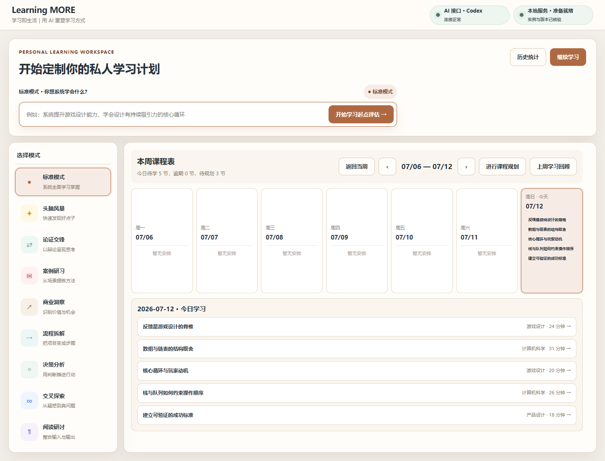
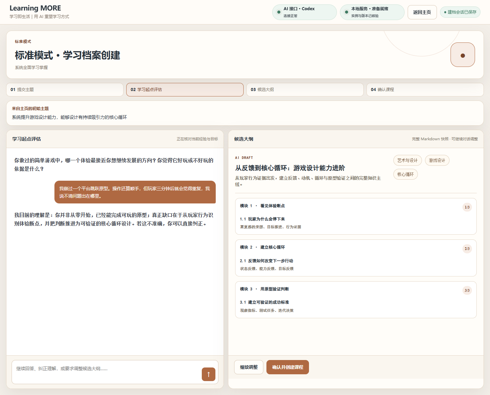
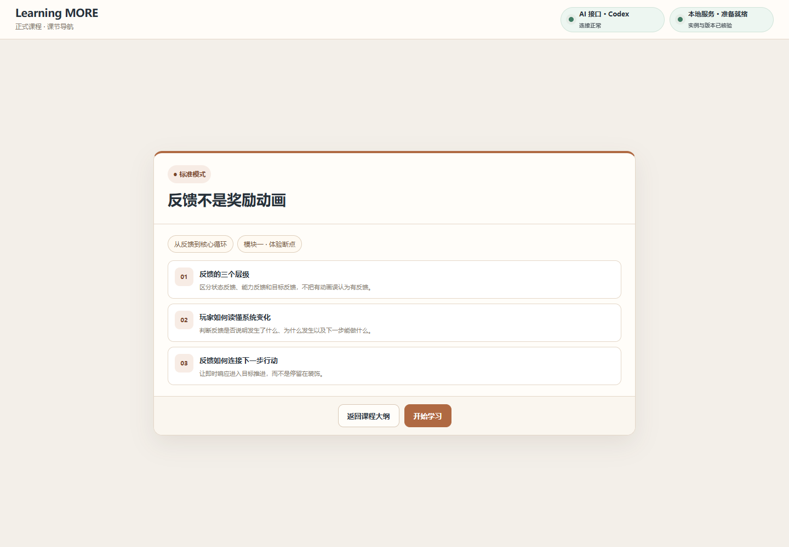
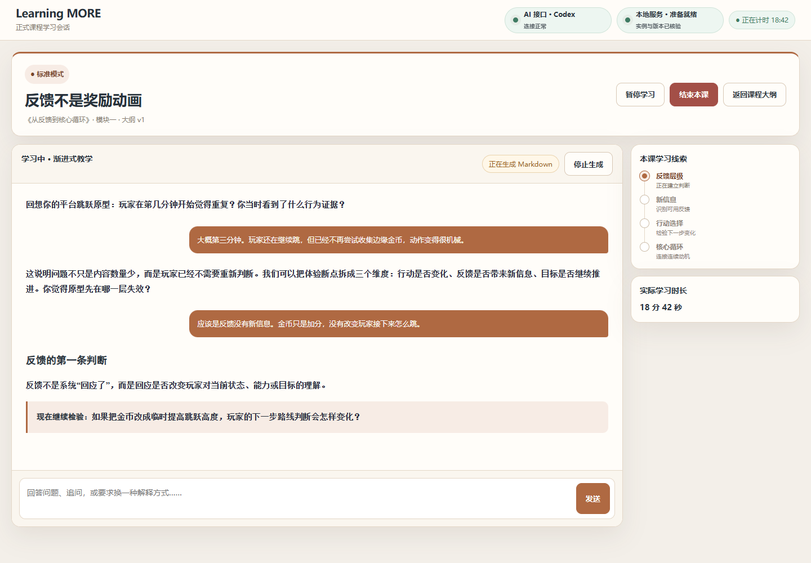
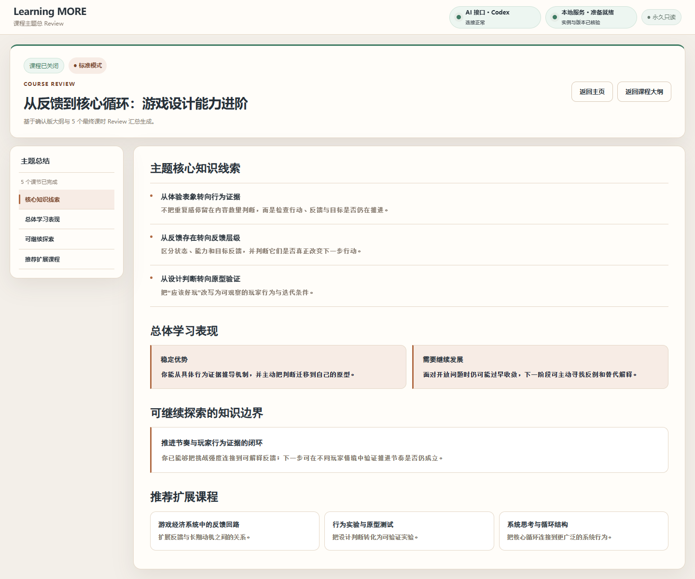
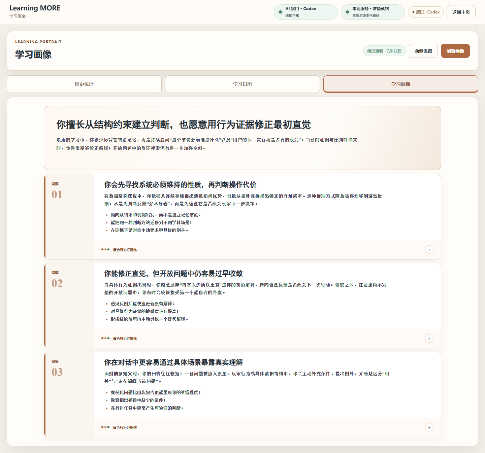
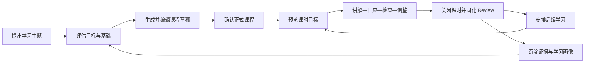

# Learning MORE

> A local-first AI learning system that turns a topic into a structured course, guided study, review, planning, and long-term learning insight.

Learning MORE 是我给自己做的一套深度学习工具，也还在持续迭代中。它不把 AI 当作一次性答案生成器，而是尝试把“想学一个主题”推进成一门可编辑的课程、一段有教学节奏的学习过程，以及之后仍能被追溯和修订的认知记录，也作为对“AI如何重塑人们的学习方式”的一种实验性质的个人探索。

当前公开仓库是经过脱敏、移除原始 Git 历史的作品集快照。截图使用虚构课程和演示数据，不包含真实学习记录、本地运行数据或个人画像。

## Case study snapshot

| 项目维度 | 设计选择                                                  |
| -------- | --------------------------------------------------------- |
| 使用场景 | 单用户、本地优先的长期深度学习                            |
| 核心问题 | AI 能生成内容，但很难持续维护课程结构、教学状态和学习证据 |
| 产品闭环 | 主题 → 建课 → 教学 → Review → 后续规划 → 学习画像         |
| 我的工作 | 产品定义、交互与状态设计、全栈实现、质量体系              |
| 当前状态 | 自用中，持续迭代                                          |

## The problem

我想解决的不是“怎样更快获得一段解释”，而是几个更长期的问题：

1. **开始之前，学习目标仍然模糊。** 一个主题通常缺少范围、先修知识、难度和验收方式，直接让模型输出内容容易得到一份看起来完整、实际不适合自己的大纲。
2. **学习过程中，聊天没有课程状态。** 教学、追问、自由探索和总结混在同一条对话里，系统很难判断现在该继续讲、检查理解，还是结束课时。
3. **长期学习时，上下文很容易突破上限。** 如果每次的课程内容都是模型在同一个对话在生成，那么它们很快会因为冗长的上下文和真实学习过程脱节。
4. **结束之后，知识没有留下可验证的轨迹。** 每次课程单独生成课程小结和回顾，学习者对自己的学习情况和学习路径无法进行连贯把握。

因此，Learning MORE 的产品重点不是生成更多内容，而是在自由定制学习计划和稳定控制课程内容这两种需求之间探索平衡，同时让学习过程可管理，长期进展可追踪。

## Product walkthrough

### 1. 从模糊主题到可确认的课程



主页展示“学习入口”和本周课程表，让学习能够快速开始。



由 AI 对话收集整理用户希望学习的主题、目标、基础与偏好，再产出可修改的大纲草稿；用户确认后渲染为正式课程大纲。AI 负责降低起步成本，课程控制权仍然留在学习者手里。

### 2. 把内容组织成真正的教学过程



进入课时前先展示目标、结构和完成条件，让学习者知道这节课为什么存在，也让系统拥有清晰的教学边界。



课时内部不是连续输出长文，而是“讲解—回应—检查—调整”的小循环。教学模式决定的是节奏和反馈方式，不是换一套视觉主题；正式教学与自由追问也使用不同状态，避免探索内容被误写成课程事实。

### 3. 关闭课时，并让认知继续生长



课时结束后生成只读 Review。关闭意味着这一轮教学事实已经固定，后续补充不会悄悄改写当时发生过什么；如果还想继续探索，会进入新的独立会话。



学习画像不会把模型判断直接当成事实。它从已完成课时、学习者表达和 Review 中提取证据，再形成候选洞察；结论保留来源，并允许随着新证据被修订。

## Key product decisions

### 教学模式会影响教学设计和观察重点

不同主题需要不同的教学节奏：有的适合先讲框架再练习，有的更适合通过问题逐步暴露误区。模式会影响讲解粒度、检查频率和追问策略，但不会把同一门课程拆成互不兼容的产品。

### 可自由定制、可编辑修改的AI课程大纲

大纲生成得再合理，也不能代表学习者已经接受了范围和路径。因此系统区分草稿与正式课程：生成、编辑、重新生成都发生在确认之前，确认才建立稳定的课程身份和课时关系。

### 正式教学也可以是自由探索

正式课时有框架进度、完成条件和 Review；但课程也鼓励发散思考、深入探讨真正有价值的洞察，并最终由AI收束回课程主线。两者可以互相引用，但不会共用关闭逻辑。

### Review 关闭后只读

、Review 固化当时的学习事实；后续修正通过新记录发生。这样历史、统计和画像都能知道一条结论是在什么上下文中产生的。

### 学习画像必须带证据，也必须允许被推翻

Learning MORE 把事实、证据、候选结论和最终洞察分层保存；没有来源的判断不会成为稳定画像，新证据也可以降低或替换旧结论。

## Closed-loop model



这个闭环刻意保留两个回路：短回路帮助下一节课继续推进，长回路让新证据反过来影响未来的课程设计。

## How the system supports the product

| 产品需要                         | 系统设计                                                |
| -------------------------------- | ------------------------------------------------------- |
| 草稿可修改、确认后稳定           | 课程草稿与正式课程分离，使用共享 Contracts 约束状态转换 |
| 教学可以流式进行，也能从失败恢复 | HTTP/SSE 传输、AI 任务租约、重试与恢复机制              |
| Review 和画像可追溯              | 事实、事件、投影、索引与来源引用分层保存                |
| Web 与本地运行保持一致           | React 前端、Node.js 模块化单体与 Repository 边界        |
| 本地产品可升级、可回滚           | Windows Host / Launcher、版本激活、健康检查和恢复流程   |

主要目录：

| Area                          | Responsibility                         |
| ----------------------------- | -------------------------------------- |
| `apps/web`                    | React 产品界面、路由、学习与建课交互   |
| `apps/server`                 | HTTP/SSE 边界、领域编排与持久化        |
| `packages/contracts`          | Zod Schema、错误码、OpenAPI 与流式协议 |
| `packages/ui`                 | 可复用的产品 UI 基础组件               |
| `apps/host` / `apps/launcher` | 本地守护、版本激活、健康检查与恢复     |
| `tools/architecture`          | 架构边界、数据键和功能等价验证         |

## Quality evidence

质量门槛围绕产品风险设计，而不只是“能构建”：

- Prettier、ESLint 与 TypeScript 全工作区检查；
- Zod / OpenAPI Schema 一致性和错误协议验证；
- 架构边界、数据键、禁止依赖与功能等价矩阵；
- Vitest 单元测试、仓库契约测试和状态恢复测试；
- Playwright 浏览器、HTTP/SSE、视觉与无障碍验收；
- 全工作区构建、依赖许可与漏洞策略检查。

## Quick start

### Requirements

- Node.js `24.17.x`
- Corepack
- pnpm `10.34.3`

### Install and verify

```powershell
corepack pnpm install --frozen-lockfile
corepack pnpm verify
```

### Start development services

```powershell
corepack pnpm dev
```

本地入口、AI Provider 与运行目录由环境和本地配置决定。请勿把真实密钥或运行数据提交到仓库。

## Privacy and sanitized data

这个仓库由私有工作副本导出的历史无关快照构成。导出时有意排除了：

- 原始 Git 历史与作者元数据；
- 本地数据库、备份、学习记录、用户画像和 AI 任务数据；
- Provider 配置、环境文件、凭据、密钥与证书；
- 日志、缓存、依赖、构建结果和测试产物。

截图中的课程、对话与画像均为虚构演示内容。详见 [SECURITY_AND_PRIVACY.md](./SECURITY_AND_PRIVACY.md) 与 [SANITIZATION_REPORT.md](./SANITIZATION_REPORT.md)。

## Current boundaries

- 当前面向单用户、本地优先场景，不提供账号体系或云同步。
- AI 教学质量仍受 Provider、模型与 Prompt 影响；系统保证的是过程边界、证据和恢复能力，而不是答案永远正确。
- 通用附件、网页抓取和多人协作不属于当前已实现范围。
- 真实机器上的长期运行、升级与故障演练仍在持续验证。

## What I am exploring next

- 让课程目标、检查问题与 Review 证据之间的关系更直接；
- 根据长期证据调整教学节奏，而不是简单个性化措辞；
- 改进跨课程知识关联，同时保留结论的来源和可撤销性；
- 继续缩短本地 AI 失败后的恢复路径。

## Personal Growth OS

Learning MORE 是 Personal Growth OS 的学习与知识内化部分。配套项目 [Week UP](https://github.com/mixn1998/week-up) 负责目标、计划、执行和周期复盘；两者共同探索从学习意图到每日行动，再到长期认知变化的个人成长闭环。

## Copyright

Copyright © 2026 mixn1998. All rights reserved.

This repository does not grant an open-source license. Without prior written permission from the copyright owner, you may not copy, modify, distribute, commercialize, or otherwise reuse this project or its source code. Public visibility is provided only for portfolio presentation, technical discussion, and evaluation.

本仓库未授予任何开源许可证。未经版权所有者书面许可，不得复制、修改、分发、商业化或以其他方式复用本项目及其源代码。公开可见仅用于作品展示、技术交流与评估。
