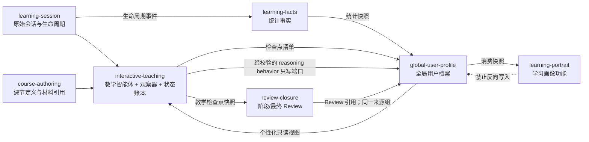

# 教学智能体、教学观察与教学状态账本纵向切片设计

## 1. 状态与目标

状态：已确认设计方向，待按实施计划开发。

本设计落地一条可运行的纵向切片：学习者发送消息后，教学智能体依据真实上下文自由推进教学；完整回复提交后，独立教学观察器异步提炼局部语义观察；确定性教学状态账本归并观察；下一回合继续使用最新账本与尚未观察的原始消息；暂停、放弃或结课时冻结检查点快照，供 Review 和全局用户档案消费。

这条切片的目的不是建立一套更大的 Prompt 模板，而是把 AI 的自由生成与业务状态、证据治理和长期个性化分开。

## 2. 已确认的设计决定

1. 采用“逐回合异步观察 + 检查点汇总”，观察不阻塞当前回复展示。
2. 教学智能体与教学观察器使用不同职责和输出合同。教学智能体输出自由 Markdown；观察器输出严格、可校验的内部结构。
3. 教学观察和教学状态账本属于课节会话级短期数据，不直接写入全局用户档案。
4. Review 消费冻结的教学检查点快照，不自行扫描并重新解释整段原始对话。
5. 全局用户档案在受控检查点从教学观察、Review 和学习事实中提炼用户档案候选证据。
6. 学习画像是用户可见功能模块和生成结果；全局用户档案是后台长期数据域。学习画像只读档案快照，不能反向维护档案事实。
7. 不使用固定教学步骤、固定问题轮次、固定示例类型、固定 Review 章节或固定画像维度来约束 AI。

## 3. 备选方案与选择

### 3.1 单次模型调用同时生成教学正文和隐藏观察

优点是成本和延迟最低。缺点是教学输出与状态判断相互污染，模型容易为了满足隐藏结构而模板化正文，也会产生自我评价偏差。未采用。

### 3.2 独立逐回合观察器与确定性账本

教学回复完成后再运行观察器，观察结果经校验后进入账本。教学正文保持高自由度；状态可重建、可审计、可更换观察模型。采用此方案。

### 3.3 仅在暂停或结课时批量扫描对话

成本较低，但实时教学拿不到已发生互动的语义状态，下一回合仍会主要依赖长对话重读，不能形成真正的互动式教学运行时。仅作为故障恢复时的补偿路径，不作为正常流程。

## 4. 领域术语

### 4.1 教学回合

从上一个已观察游标之后开始，到一个完整 AI 回复结束的不可变消息范围。正常情况下包含学习者消息和对应的完整 AI 回复；恢复扫描可以包含多个连续回合。被停止或技术中断的 AI 残缺输出不构成完整教学回合。

### 4.2 教学智能体

依据课节责任、真实材料、当前教学状态、相关长期个性化视图和最近对话，自由决定下一段讲解、提问、案例、纠偏和节奏的 AI 能力。它只生成给学习者看的 Markdown，不直接写掌握结论、用户档案或 Review。

### 4.3 教学观察

观察器针对一个不可变消息范围形成的、局部且带精确来源引用的语义记录。它可以记录已发生的实质讲解、学习者展示的掌握证据、暴露的偏差、具体问题、显式目标或约束以及仍待处理的开放项。它不是原始事实、不是 Review，也不是用户档案候选证据。

### 4.4 教学状态账本

按顺序归并有效教学观察形成的课节会话级可重建投影。账本回答“本课已经发生了什么、还有什么未处理”，不形成永久人格、能力等级或学习偏好标签。

### 4.5 教学检查点快照

在手动暂停、有证据放弃、最终结课等业务检查点冻结的账本、观察引用和消息范围快照。Review 与全局用户档案只消费该快照或其精确来源引用，不自行建立另一套教学状态。

### 4.6 用户档案候选证据

全局用户档案在受控检查点提炼的中性、局部、可追溯长期材料。它可以来自学习者显式声明或真实互动观察，但不等同于稳定用户结论，也不要求预设画像维度。

### 4.7 全局用户档案

后台长期数据域。它维护学习统计快照、用户档案候选证据、来源关系、失效状态、消费游标、档案版本和个性化消费视图。它不是一篇 AI 文案，也不是用户直接编辑的一组标签。

### 4.8 学习画像

用户可见功能模块。它读取某个全局用户档案消费快照，自由生成标题、摘要和数量不定的洞察及证据链。画像版本不能成为全局用户档案的权威数据源，也不能直接回灌教学。

### 4.9 思维行为 Episode 与动态维度

`ReasoningBehaviorEpisode` 是从有效 `learner_reasoning_behavior` 观察投影出的单次、局部、带来源行为记录。全局用户档案可在指定证据窗口中让 AI 自由归纳动态维度并做多标签分类，再由后端确定性统计。维度不预设、不固定为数据库列，也不等于人格、能力或永久思维类型。

## 5. 模块关系与数据流



### 5.1 权威数据与消费矩阵

| 模块 | 权威拥有 | 只读消费 | 对外产出 | 明确禁止 |
| --- | --- | --- | --- | --- |
| `course-authoring` | `LessonDefinition`、核心知识点、材料引用、版本绑定 | 大纲创建输入 | 不可变课节定义 | 写教学状态、掌握结论 |
| `learning-session` | 原始消息顺序、完成状态、课节生命周期、写入权、计时、会话保留标记 | 课节命令 | 会话视图、生命周期事件 | 按字数或正则判断语义；维护长期用户档案 |
| `interactive-teaching` | 教学观察、观察游标、教学状态账本、检查点快照 | 课节定义、材料正文、原始消息、已完成 Review、个性化视图 | 自由教学回复、账本状态、冻结快照；经 Port 发布有效 reasoning behavior | import/拥有全局用户档案实现；拥有 Review；生成学习画像 |
| `review-closure` | 当前唯一阶段 Review、最终不可变 Review、关闭事务 | 教学检查点快照、已有阶段 Review | Review Artifact 与完成事件 | 重扫原始对话建立另一套状态；写画像结论 |
| `learning-facts` | 生命周期和统计事实投影 | 业务事件 | 可重建统计读模型 | 解释对话语义、保存教学观察 |
| `global-user-profile` | 用户档案候选证据、ReasoningBehaviorEpisode、动态维度/分类/统计、来源组、档案版本、失效关系、统计快照索引、消费清单 | 教学检查点、有效 reasoning behavior、Review、学习事实 | 个性化视图、画像消费快照、可过滤行为分析 | 决定当轮教学；拥有画像文案或 UI |
| `learning-portrait` | 画像生成任务、画像版本和用户可见结果 | 全局用户档案消费快照 | 自由画像结果 | 反向修改证据、统计事实或个性化档案 |

## 6. 深模块边界

### 6.1 `interactive-teaching`

这是本纵向切片的主深模块。它内部包含上下文装配、教学智能体适配、逐回合观察调度、观察校验、账本归并和检查点冻结。外部不需要知道使用了几个模型调用、如何裁剪上下文或如何重放观察。

公开 Interface 只提供：

```ts
interface InteractiveTeaching {
  advanceTurn(input: AdvanceTeachingTurn, context: CommandContext): Promise<TeachingTurnAccepted>;
  stopTurn(input: StopTeachingTurn, context: CommandContext): Promise<TeachingTurnStopped>;
  getTeachingState(sessionId: string): Promise<TeachingStateSnapshot>;
  freezeCheckpoint(input: FreezeTeachingCheckpoint): Promise<TeachingCheckpointSnapshot>;
}
```

恢复未完成观察属于模块启动恢复能力，不扩展成面向 HTTP 的业务接口。

### 6.2 `global-user-profile`

这是长期数据维护深模块。它内部包含统计快照同步、候选证据提炼、ReasoningBehaviorEpisode、AI 动态维度归纳与多标签分类、确定性统计、来源组和依赖关系、幂等去重、安全门禁、失效重算、消费快照和个性化视图。学习画像和教学模块看不到其内部存储布局。

公开 Interface 只提供：

```ts
interface GlobalUserProfile {
  ingestCheckpoint(input: UserProfileCheckpointManifest): Promise<UserProfileIngestionResult>;
  captureReasoningBehavior(input: ReasoningBehaviorObservation): Promise<CaptureResult>;
  refreshReasoningAnalysis(filter?: ReasoningAnalysisFilter): Promise<ReasoningAnalysisSnapshot | undefined>;
  getPersonalizationView(input: PersonalizationQuery): Promise<PersonalizationView>;
  createConsumerSnapshot(input: ConsumerSnapshotQuery): Promise<GlobalUserProfileSnapshot>;
  retractCourseSources(courseId: string): Promise<void>;
}
```

`interactive-teaching` 不直接 import `global-user-profile`。它依赖自己定义的 `PersonalizationContextSource` 与 `ReasoningBehaviorSink` Port，由组合根用全局用户档案 adapter 实现，避免模块循环。账本提交成功但 reasoning 投影失败时保留可恢复状态，启动恢复按观察身份补写；不能为了长期分析阻断已经成功的教学回复。

### 6.3 保持独立的模块

- `learning-session` 继续拥有会话和课节生命周期，不并入互动教学深模块。
- `review-closure` 继续拥有 Review 与关闭事务，不并入互动教学深模块。
- `learning-portrait` 保持用户可见功能模块，不并入全局用户档案。
- `generation-runtime` 和 AI Provider 是技术基础设施，不包含教学业务策略。

### 6.4 八种玩法共用通用深模块

八种玩法与标准模式共用同一个 `interactive-teaching` Interface、教学观察合同、状态账本、Review 链路和全局用户档案管线。系统不为玩法复制智能体、状态机、观察 Schema、账本字段或证据提炼器。

课程创建阶段只向教学上下文延续 `courseMode` 和非强制 `playIntent`。`playIntent` 表达该玩法希望带来的整体学习体验，帮助教学智能体发现教学机会，但不编译为固定步骤、阶段、问题数量、方法库或完成条件。所有玩法继续遵守核心知识责任、用户结束权、对话不可改写、教学支线和统一闭环规则。

这两项都来自第二层“课程与本课契约层”，但权威性不同：`courseMode` 是已确认课程的来源身份事实，只负责选择对应的 `playIntent` 和保留产品身份；`playIntent` 是第二层中的软性体验倾向，不是本课知识责任。系统不设置 `modeWeight`、百分比、每回合配额或玩法方法命中率。玩法影响采用“条件显著性”：只有当前学习目标、用户表达和账本状态允许多个合理教学动作时，`playIntent` 才作为择优信号，帮助 AI 更容易注意到该玩法重视的教学机会。

因此，玩法影响的运行规则是：

- 当前用户明确问题、纠错需求和节奏选择始终优先；
- 当前课节核心知识责任、真实材料和未解决开放项不能被玩法覆盖；
- 在多个教学动作都能履行上述责任时，优先选择更能实现 `playIntent` 的动作；
- 没有自然机会时允许暂时不体现玩法，不要求每回合表演玩法形式；
- 当误解已经澄清、前置知识已经补足或用户主动进入相关探索时，玩法倾向可以重新变得显著；
- `standard` 不携带 `playIntent`，由当前主题、课节责任、实时证据和用户选择直接决定下一步。

这使八种玩法与标准模式的差异落在“AI 更容易发现并选择什么有价值的下一步”，而不是“回复必须长成什么样”。例如论证交锋可以在主张和证据真正成为学习关键时自然引入强反方，但不要求每回合辩论；案例研习可以在抽象理解需要情境检验时进入案例，但不要求每课套案例结构。

玩法差异在课节级而非回合级验收。质量评估使用同主题、同课节责任和同用户轨迹的标准模式/玩法模式成对样本，分别检查：本课责任是否履行、玩法关注是否在自然机会中可辨认、是否为表现玩法而忽略用户当前问题、跨回合结构是否仍有变化。观察器和账本不增加“玩法命中”字段；这组评估属于离线质量评测，不能反向成为运行时配额。

`courseMode` 进入全局用户档案时只是来源情境事实，单次选择不能形成稳定偏好。学习画像不能按八种玩法预设固定洞察栏目。

## 7. 教学智能体策略

### 7.0 教学智能体边界

教学智能体是 `interactive-teaching` 内部的高自由度生成 Port，不是业务模块或状态机：

```ts
interface TeachingAgent {
  submit(context: TeachingContextPackage): Promise<{ taskId: string }>;
  complete(taskId: string, signal: AbortSignal): Promise<{ markdown: string }>;
  stop(taskId: string): Promise<{ markdown: string; completionStatus: 'interrupted' }>;
}
```

它只能读取已装配上下文并输出面向学习者的 Markdown。它可以自由讲解、换案例、追问、纠偏、提出任务、回到主线和建议继续或结束；它不能直接读取 Repository 或 Artifact 路径，不能修改课节生命周期，不能建立 `evidenceCheckpoint`，不能持久化掌握状态，不能写教学观察、账本、Review、全局用户档案或学习画像。关键互动和教学效果由回复完成后的观察器识别并校验，不要求教学智能体输出隐藏 JSON 或业务事件。

### 7.1 输入是事实包，不是场景 Prompt

`TeachingContextPackage` 必须实际装配内容，不能只传 `templateRef`、`artifactRef` 或 `manifestRef` 让 Provider 猜测：

```ts
type TeachingContextPackage = Readonly<{
  schemaVersion: 1;
  course: {
    courseId: string;
    outlineVersionId: string;
    title: string;
    courseMode: string;
    playIntent?: string;
    goals: readonly string[];
    lessonMap: readonly {
      lessonId: string;
      title: string;
      objective: string;
      relation: 'current' | 'prerequisite' | 'other';
    }[];
  };
  lesson: {
    lessonId: string;
    outlineVersionId: string;
    title: string;
    objective: string;
    coreKnowledgePoints: readonly { ref: string; text: string }[];
  };
  learningStartSummary?: string;
  relevantFinalReviews: readonly SourceExcerpt[];
  readingMaterialExcerpts: readonly SourceExcerpt[];
  personalization: PersonalizationView;
  teachingState: TeachingStateSnapshot;
  recentMessages: readonly MaterializedTeachingMessage[];
  unobservedMessages: readonly MaterializedTeachingMessage[];
}>;
```

不构造 `TeachingScopeEnvelope`、允许主题清单或前置知识白名单。上下文客观提供当前课节定义、整门课程结构、真实材料、教学账本、最近对话和用户档案视图；教学智能体自行发现对教学有价值的前置知识、类比、跨域案例和邻接方向。

课程相关性通过回复完成后的语义关系判断，而不是生成前许可或关键词相似度定义。任何跨领域案例、类比、任务或补充知识都可以出现。与课程相关但不属于当前课节的用户脑洞属于 `adjacent` 课程邻接探索，可以自然展开并形成教学支线；它不更新当前核心知识点覆盖，也不自动完成未来课节。个性化视图只能改变讲法、案例、深度和节奏，不能扩大课节责任。明显无关的用户请求可以被简短承接或澄清，但不能静默把本课改成另一主题。

教学支线必须保存发起问题、课程主题关联和返回主线锚点。支线成为新的主要学习目标时，教学智能体把选择权交给学习者：继续支线、暂存后返回本课，或以后建立补充学习/新课；不得自动修改确认版大纲。

`TeachingContextAssembler` 按以下层级装配，并记录每段内容的 `sourceRef`、版本和选取原因。这里的层级定义数据来源、保留顺序和冲突权威，不等于要求模型逐层执行：

1. 当前事实层：当前用户消息、最近完整对话和账本游标后的未观察消息。不可裁剪。
2. 课程与本课契约层：
   - 2A 责任事实：绑定版本的课程目标、课程课节地图、当前课节目标、全部核心知识点、材料映射和必要原文片段；当前课节核心知识点不可裁剪。
   - 2B 玩法倾向：`courseMode` 是课程身份事实；八种玩法附带一段非强制 `playIntent`，标准模式不附带。2B 只在多个合格教学动作之间择优，不能覆盖 1、2A 或当前账本事实。
3. 会话状态层：最新账本中的讲解覆盖、支持/限制性证据、开放项和观察游标。开放项及其来源不可裁剪。
4. 课程继承层：学习起点评估、与当前课节相关的已完成最终 Review 和课程记忆摘要。
5. 长期个性化层：全局用户档案返回的用途化 `PersonalizationView`，不包含学习画像 Markdown。

事实冲突时遵循：当前明确表达优先于历史弱信号，原始来源优先于派生摘要，当前课节绑定版本优先于后续大纲版本。Token 不足时依次裁剪长期弱信号、较远 Review、较远对话和材料扩展片段；不得裁剪当前消息、核心知识责任、开放项及其证据引用。

观察异步未完成时，装配器同时提供最后一个稳定账本和 `unobservedMessages`。教学智能体因此不会因账本短暂陈旧而遗漏最新互动，也不需要等待观察任务才能开始下一回合。

业务层不维护 `lesson-response@vN` 场景模板。模型 adapter 只携带一个稳定、短小的能力契约：继续互动式教学、核心知识点是责任而非顺序、玩法意图只在出现自然教学机会时影响下一步选择且不必每回合显式呈现、不得伪造证据、只输出面向学习者的 Markdown。教学方法、结构、案例、问题数量和顺序全部自由。

### 7.2 个性化上下文的权限

教学上下文只读取全局用户档案生成的当前用途视图，不读取学习画像 Markdown。个性化视图中：

- 用户显式目标、约束和已确认偏好可以作为直接上下文；
- AI 观察只能作为有来源和局限说明的弱信号；
- 当前会话里的最新明确表达优先于历史推断；
- 不把人格、能力等级、医疗、政治、身份等敏感推断传给教学智能体；
- 个性化视图缺失时教学仍可完整运行。

### 7.3 输出自由度

教学智能体唯一输出合同是完整 Markdown。系统不要求固定标题、固定段落、固定互动次数、固定知识点顺序或隐藏 JSON Sidecar。业务效果由后置观察器识别，不通过正文模板强迫模型声明。

## 8. 教学观察合同

观察器只读取完成状态明确的消息、当前课节核心知识点、上一个账本状态和精确来源 ID。观察器允许输出零条观察。

```ts
type TeachingObservationKind =
  | 'teaching_delivery'
  | 'learner_demonstration'
  | 'learner_misconception'
  | 'learner_question'
  | 'learner_intent'
  | 'adjacent_exploration'
  | 'open_loop';

type TeachingObservationEntry = Readonly<{
  entryId: string;
  kind: TeachingObservationKind;
  summary: string;
  knowledgePointRefs: readonly string[];
  sourceRefs: readonly string[];
  assessment?: 'supports' | 'limits' | 'uncertain';
  explicitness?: 'user_declared' | 'ai_observed';
  resolvesEntryRefs: readonly string[];
  qualityFlags: readonly ('direct' | 'complete' | 'ambiguous')[];
}>;

type TeachingObservation = Readonly<{
  observationId: string;
  schemaVersion: 1;
  lessonId: string;
  sessionId: string;
  turnSequence: number;
  sourceMessageIds: readonly string[];
  sourceSnapshotHash: string;
  scope: Readonly<{
    alignment: 'direct' | 'supporting' | 'adjacent' | 'unclear' | 'off_scope';
    relationRefs: readonly string[];
    rationale: string;
  }>;
  entries: readonly TeachingObservationEntry[];
  observerVersion: string;
  observedAt: string;
  status: 'active' | 'superseded' | 'retracted';
}>;
```

固定 `kind` 只描述业务后果，不规定教师采用什么教学方法。`summary` 保持自由语义；`knowledgePointRefs` 和 `sourceRefs` 必须由系统校验。观察器不得生成稳定画像、人格、能力等级或无来源推断。

### 8.1 观察校验

提交前必须同时满足：

- 来源消息属于当前会话和冻结范围；
- 用作教学或掌握证据的 AI 消息状态为 `complete`；
- 所有知识点引用属于绑定的 `LessonDefinition`；
- `resolvesEntryRefs` 指向当前账本中的有效开放项；
- `summary` 非空且不包含来源之外的新个人事实；
- `direct`、`supporting` 或 `adjacent` 的关系判断至少引用一个存在于课节、课程或当前消息上下文中的有效来源；
- 同一 `sourceSnapshotHash + observerVersion` 幂等；
- 校验失败不写入部分记录。

## 9. 教学状态账本

观察器不能直接输出整个教学状态。账本由确定性 Reducer 按 `turnSequence` 归并有效观察：

```ts
type TeachingStateSnapshot = Readonly<{
  schemaVersion: 1;
  lessonId: string;
  sessionId: string;
  ledgerVersion: number;
  observedThroughMessageId?: string;
  sourceSnapshotHash: string;
  observationStatus: 'current' | 'pending' | 'failed';
  scopeStatus: 'aligned' | 'needs_return';
  evidenceCheckpoint: boolean;
  knowledgePoints: readonly Readonly<{
    ref: string;
    delivery: 'not_addressed' | 'explained';
    verification: 'not_observed' | 'supporting' | 'limiting' | 'mixed';
    teachingEvidenceRefs: readonly string[];
    learnerEvidenceRefs: readonly string[];
    unresolvedEntryRefs: readonly string[];
  }>[];
  openLoops: readonly Readonly<{
    entryId: string;
    summary: string;
    knowledgePointRefs: readonly string[];
    sourceRefs: readonly string[];
  }>[];
  explorationBranches: readonly Readonly<{
    entryId: string;
    summary: string;
    courseTopicRefs: readonly string[];
    sourceRefs: readonly string[];
    returnAnchorRefs: readonly string[];
    status: 'active' | 'parked' | 'returned';
  }>[];
  recentLearnerSignals: readonly Readonly<{
    entryId: string;
    summary: string;
    explicitness: 'user_declared' | 'ai_observed';
    sourceRefs: readonly string[];
  }>[];
}>;
```

账本不持久化 `mastered: true`、用户能力分数或固定学习风格。`verification` 只描述当前证据方向；矛盾证据保留为 `mixed`。核心知识责任是否满足由调用方依据“已讲解或有支持性掌握证据”确定，但开放项和限制证据必须一并呈现。

`evidenceCheckpoint` 只能由通过校验的语义观察建立，不能由消息长度、消息数量、页面行为或时间建立。观察尚未完成或失败且存在未观察消息时，放弃策略优先保留会话，但不能伪造 `evidenceCheckpoint = true`。

`adjacent` 形成独立教学支线，不更新当前课节知识点覆盖，除非同一回合另有经过校验的 `supporting` 或 `direct` 观察。`unclear` 或 `off_scope` 的输出不能更新知识点讲解覆盖或掌握状态；Reducer 把返回主线写入开放项并设置 `scopeStatus = needs_return`。下一回合携带动态形成的返回主线引用。`off_scope` 采用保守判定：只有无法与课程、学习目标或用户当前学习意图建立合理关系时才使用；新颖、跨域或尚未映射到大纲的脑洞优先保留为 `adjacent` 或 `unclear`。

本纵向切片不设置生成前范围 Gate，也不因为 `adjacent` 重写、拦截或重新生成回复。系统只约束内容产生的业务后果，不预先限制 AI 可以发现的教学关系。

## 10. 正常回合时序

1. HTTP 路由把用户 Markdown 保存为不可变 Artifact，并调用 `advanceTurn`。
2. `interactive-teaching` 通过 `learning-session` 追加用户消息，不在路由层做语义分类。
3. 上下文装配器读取课节定义、材料正文、已完成 Review、个性化视图、账本和原始消息增量。
4. 教学智能体生成自由 Markdown；流式输出沿用 `generation-runtime`。
5. 只有完整回复才以 `completionStatus = complete` 提交到消息日志。
6. 当前回复立即对用户可用；模块随后为该不可变消息范围排队观察任务。
7. 观察器输出经 Schema 和来源校验后，与新账本状态在同一 UnitOfWork 中提交。
8. 下一回合读取最新账本；若观察仍在排队，则同时携带账本游标后的原始消息，避免教学智能体遗漏最新互动。

## 11. 检查点、Review 与全局用户档案

### 11.1 冻结检查点

```ts
type TeachingCheckpointSnapshot = Readonly<{
  checkpointId: string;
  reason: 'manual_pause' | 'evidenced_abandon' | 'lesson_closure';
  lessonId: string;
  sessionId: string;
  teachingState: TeachingStateSnapshot;
  observationRefs: readonly string[];
  sourceMessageIds: readonly string[];
  sourceSnapshotHash: string;
  observationCompleteness: 'complete' | 'pending' | 'failed';
  retentionDecision: 'discardable' | 'preserve';
  frozenAt: string;
}>;
```

- 手动暂停只有在相对上次档案检查点存在实质新观察时才进入档案提炼队列。
- 有证据放弃冻结快照并生成或更新阶段 Review。
- 最终结课冻结快照，最终 Review 成功提交后再形成完整用户档案检查点清单。
- 如果观察待处理或失败，快照的 `retentionDecision` 必须为 `preserve`；Review 和档案提炼可以进入可重试状态。

### 11.2 Review 消费

Review 输入由服务器生成，包含教学检查点快照引用、已有阶段 Review 引用和固定来源哈希。客户端不再提交权威 `sourceMessageIds` 或自算 checksum。

Review 仍输出自由 Markdown。系统不要求固定标题和段落，但生成输入必须完整提供：已讲解或已验证的核心知识点、掌握证据与限制证据、仍未完成或未验证的责任、开放问题和精确来源。Review 生成器不能写教学账本，也不能把 Review 当作新的独立来源组。

### 11.3 全局用户档案摄取

应用编排层在检查点稳定后构造清单：

```ts
type UserProfileCheckpointManifest = Readonly<{
  checkpointId: string;
  checkpointReason: TeachingCheckpointSnapshot['reason'];
  sourceSnapshotHash: string;
  teachingSnapshotRef: string;
  reviewRef?: string;
  sourceGroupId: string;
  dependentSourceGroupIds: readonly string[];
  completeness: 'complete' | 'partial';
}>;
```

全局用户档案提炼器只读该清单和精确来源，允许生成零条用户档案候选证据。教学会话及其阶段/最终 Review 使用同一 `sourceGroupId`，防止重复计权。

## 12. 用户档案候选证据结构

```ts
type UserProfileEvidence = Readonly<{
  evidenceId: string;
  schemaVersion: 1;
  summary: string;
  explicitness: 'user_declared' | 'ai_observed';
  sourceType: 'outline' | 'lesson' | 'supplementary' | 'review' | 'fact';
  sourceRefs: readonly string[];
  sourceGroupId: string;
  dependentSourceGroupIds: readonly string[];
  courseContext?: string;
  lessonContext?: string;
  observedAt: string;
  sourceSnapshotHash: string;
  qualityFlags: readonly ('direct' | 'complete' | 'ambiguous' | 'interrupted')[];
  safetyStatus: 'usable' | 'sanitized' | 'blocked';
  blockedReason?: string;
  supersedes: readonly string[];
  extractorVersion: string;
  extractedAt: string;
  status: 'active' | 'superseded' | 'retracted';
}>;
```

现有 `claimDimension`、固定 `strength.score` 和脱离具体洞察的 `polarity` 不再属于候选证据权威结构：

- 固定维度会在证据层提前模板化未来分析；
- 单一强度分数会伪装不确定性，并诱导 UI 把内部启发式展示成可信度；
- supporting/limiting/contradicting 是“某条证据相对于某个画像洞察”的关系，不是证据自身的永久属性。

如果学习画像需要表达支持、限制或反例，该关系应存在于具体画像洞察的证据链中。

## 13. 全局用户档案与两个消费者

### 13.1 全局用户档案快照

档案快照是确定性清单，不是 AI 生成文案：

```ts
type GlobalUserProfileSnapshot = Readonly<{
  profileVersion: number;
  statisticsSnapshotRef: string;
  activeEvidenceIds: readonly string[];
  artifactIndexRefs: readonly string[];
  evidenceCursor?: string;
  completeness: 'insufficient' | 'limited' | 'complete';
  backlogCount: number;
  sourceSnapshotHash: string;
  createdAt: string;
}>;
```

### 13.2 教学个性化消费

`getPersonalizationView` 按当前课程、课节、用途和安全策略选取少量相关材料。它不返回学习画像正文，不返回无来源稳定标签，并包含局限与档案版本。当前会话显式表达可以覆盖历史弱信号，但不会改写历史证据。动态思维行为只从最新无过滤、usable 的全局快照中选取至少两个独立来源组支持的维度；定向过滤快照不能因为更新较晚而覆盖该来源。

### 13.3 学习画像消费

`learning-portrait` 读取冻结的档案消费快照，拥有自己的生成任务和版本。快照可包含上述动态思维行为分析、定义、计数、局限和来源 Episode，但不要求固定画像栏目或雷达图。它可以自由决定洞察数量、标题、组织顺序和表达，但每条洞察必须引用候选证据并检查限制或反例。画像结果不进入档案证据池。

## 14. AI 自由度分层

| AI 环节 | 自由度 | 固定内容 | 不固定内容 |
| --- | --- | --- | --- |
| 教学智能体 | 高 | 真实上下文、核心知识责任、来源边界、Markdown 输出 | 教学顺序、讲法、案例、深度、互动方式与数量 |
| 教学观察器 | 低到中 | 结构 Schema、精确引用、局部观察、安全边界、可为空 | 中性摘要措辞、观察条目数量 |
| 教学状态账本 | 无生成自由度 | 确定性 Reducer、版本和幂等规则 | 无 |
| Review 生成 | 高 | 冻结来源、必须覆盖的业务语义、不可伪造 | 标题、结构、篇幅、表达与重点组织 |
| 用户档案证据提炼 | 中 | 检查点、来源组、安全与失效规则、可为空 | 摘要表达、哪些局部材料值得保留 |
| 思维行为分析 | 中 | Episode 输入、来源校验、多标签结构、版本、确定性统计 | 当前窗口的动态维度名称、定义、纳入/排除信号和局部分类 |
| 学习画像生成 | 高 | 档案快照、证据链、限制/反例检查 | 洞察维度、数量、顺序、标题和文案 |

约束的尺度始终落在“事实、权限、业务效果和可追溯性”上，不落在“教师应该怎么讲、文案应该长什么样”上。

## 15. 并发、幂等与恢复

- 每个会话的观察任务串行提交，正常路径一回合一观察；恢复路径可以按消息顺序补扫多个未观察回合。
- 观察任务键由 `sessionId + sourceSnapshotHash + observerVersion` 组成。
- 观察和新账本状态在同一事务提交；版本冲突时重新读取账本并重放，不覆盖新状态。
- 服务启动时比较消息日志末尾与账本游标，自动排队缺失观察。
- 服务启动时也比较 active 观察与 ReasoningBehaviorEpisode 投影；同一观察条目按确定性 Episode ID 补写，不重复计数。
- 同一检查点的 `reason + sourceSnapshotHash + observationRefs + sourceMessageIds + completeness` 命中时复用已有不可变快照。
- 同一来源用新观察模型重跑时新增版本并 supersede 旧观察，不原地改义。
- Review 和用户档案提炼都绑定冻结哈希；来源变化后旧任务结果作废。

## 16. 失败策略

### 16.1 教学生成失败

不提交完整 AI 消息，也不触发该 AI 输出的观察。用户已提交消息仍保留；检查点恢复扫描可以单独观察该用户消息。已有账本不回滚。

### 16.2 用户停止生成

部分输出以 `completionStatus = interrupted` 保存，但不作为教学或掌握证据。观察器可以读取其存在来理解消息范围，却不能把其中内容写入教学证据。

### 16.3 观察失败

不影响已完成回复展示。账本标记为 `pending` 或 `failed`，下一回合同时携带未观察原始消息。放弃时优先保留会话；最终关闭和 Review 进入可重试状态，不使用过期账本伪造完成判断。

### 16.4 非法或过期观察

Schema 错误、未知知识点引用、越界来源或快照哈希不匹配均整批拒绝。失败输出不部分写入，也不设置 `evidenceCheckpoint`。

### 16.5 删除和修正

课程永久删除时，原始会话、教学观察、账本、检查点、Review、学习事实、用户档案候选证据和该课程 ReasoningBehaviorEpisode 按来源级联撤销；所有可能跨课程聚合的 reasoning 分析快照先失效，再从剩余 Episode 重建统计快照、档案快照和学习画像。重建失败不恢复已删除业务数据，也不得继续展示失效证据。

## 17. 数据治理规则

1. 原始消息和业务事件是权威来源；观察、账本、Review、统计快照、档案证据和画像均为不同层次的派生物。
2. 每个派生层必须保存来源引用、来源哈希、生成/提炼版本和状态。
3. 下游只能消费上游公开快照，不得横向重扫原始数据建立私有口径。
4. Review 与原学习会话同一来源组；课程总 Review 依赖课时 Review，不形成额外独立证据。
5. 学习画像结果、周报和技术遥测默认禁止成为全局用户档案证据。
6. 候选证据允许为空；证据不足时停止，不使用模板补齐。
7. 用户明确修正通过新增来源和 supersede 关系生效，不静默改写历史。
8. 敏感信息净化在写入全局用户档案之前完成；原始全文留在所属会话，按需读取受限片段。
9. 思维行为维度是版本化分析产物，不是固定字段；统计由已校验多标签分类确定性重算，confidence 不参与计数权重。
10. 定向过滤分析用于查询和审计；默认教学/画像只能消费最新无过滤、usable 的全局分析快照。

## 18. 测试与质量评估

### 18.1 确定性测试

- 观察 Schema、来源引用和知识点引用校验；
- 账本 Reducer 的顺序、冲突、纠偏、开放项解决和重建等价性；
- 完整、停止、失败消息的证据资格；
- 观察任务幂等、过期输出拒绝和启动恢复；
- Review 快照哈希、阶段替换和最终不可变；
- 用户档案来源组、去重、supersede、retract 和删除重建；
- ReasoningBehaviorEpisode 幂等投影、动态维度来源校验、多标签去重、过滤统计、全局快照消费选择和课程删除重建；
- 学习画像只读档案快照，禁止回写。

### 18.2 AI 质量评估样本

使用不要求固定措辞的语义断言覆盖：

- 教师可采用完全不同的讲法和顺序，但不会遗漏核心知识责任；
- 学习者正确解释、部分正确、明确误解、自我纠正、跳过、追问和改变目标；
- 观察器能输出零条，且不会从助手讲解推断学习者已掌握；
- 下一回合能利用新证据调整教学而不重复固定话术；
- Review 有来源支撑且不把未验证内容写成已掌握；
- 用户档案不从单次局部行为生成稳定标签；
- 学习画像可以改变结构与洞察维度，但证据链仍可追溯。

### 18.3 运行质量指标

内部监控观察积压、观察失败率、账本陈旧回合数、无来源观察拒绝数、Review 来源不一致数和档案失效重建状态。这些是系统质量指标，不进入全局用户档案，也不展示为学习者能力指标。

## 19. 本纵向切片范围

本次实现包含原始课节学习会话、阶段/最终/课程总 Review、教学检查点到全局用户档案候选证据的链路，以及 learner reasoning behavior 从观察到 Episode、动态维度、确定性统计、教学个性化和学习画像消费的完整链路。

本次不包含：

- 大纲创建会话的教学观察接入；
- 补充学习会话的逐回合账本；
- 固定教学方法库或课程正文预生成；
- 学习画像 UI 的整体重做；
- 用学习画像生成结果反向训练或自动修改档案；
- 周报作为档案证据来源。

后续接入大纲与补充学习时复用相同的用户档案检查点和来源治理规则，不复制新的证据管线。

## 20. 完成标准

纵向切片只有同时满足以下条件才算完成：

1. 真实教学输入已物化，教学智能体不再收到盲 `artifactRef`。
2. 教学输出不依赖场景 Prompt 模板，且保持自由 Markdown。
3. 每个完整教学回合最终都有已提交观察或明确失败/待处理状态。
4. `evidenceCheckpoint` 不再由长度、正则、消息数或时长建立。
5. 教学状态可以仅凭课节定义和有效观察重建出相同结果。
6. Review 绑定服务器冻结的教学快照并使用真实账本语义。
7. 用户档案候选证据带精确来源、来源组、快照哈希、安全和失效信息。
8. 学习画像与全局用户档案在代码 Interface、数据合同和文档中清晰分离。
9. 课程删除能撤销整条来源链并触发档案及画像重建。
10. 思维行为不是固定列；Episode、动态维度、分类、过滤统计和默认全局消费选择均可验证。
11. 架构检查、类型检查、相关测试和端到端纵向测试全部通过。
